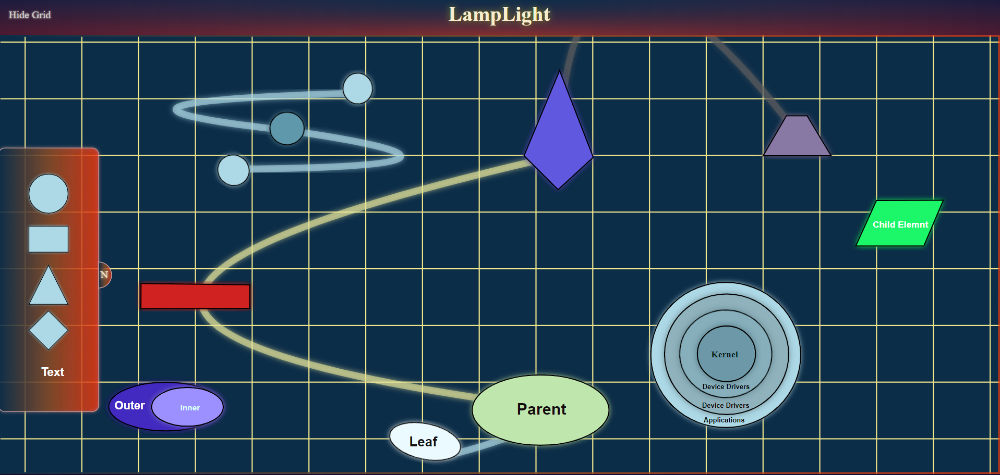
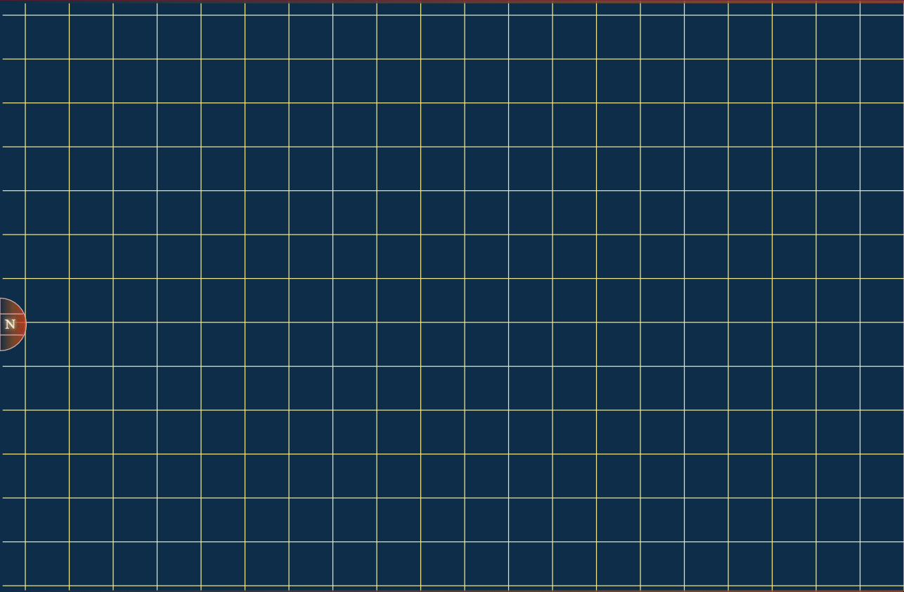
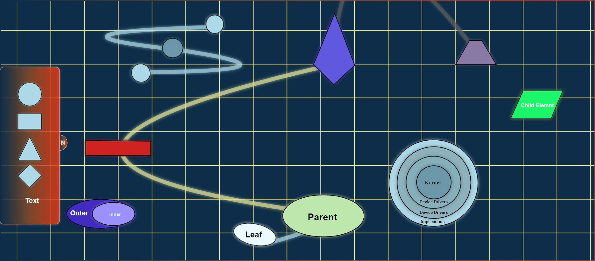
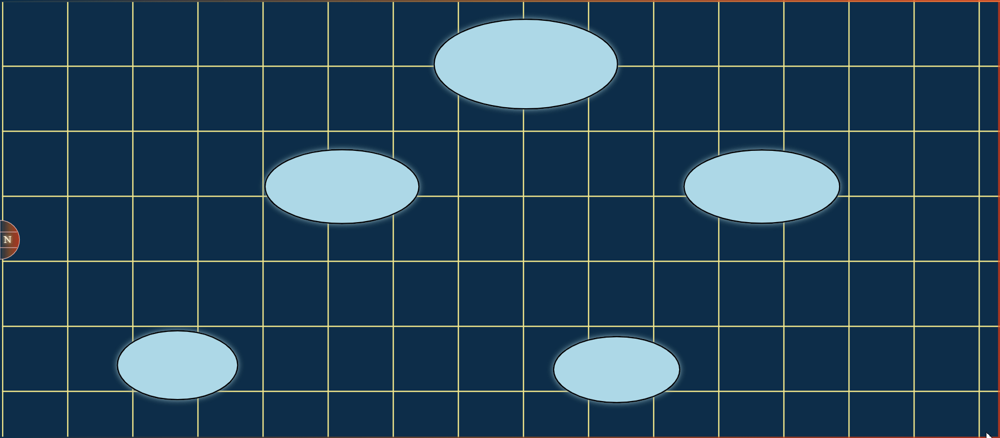
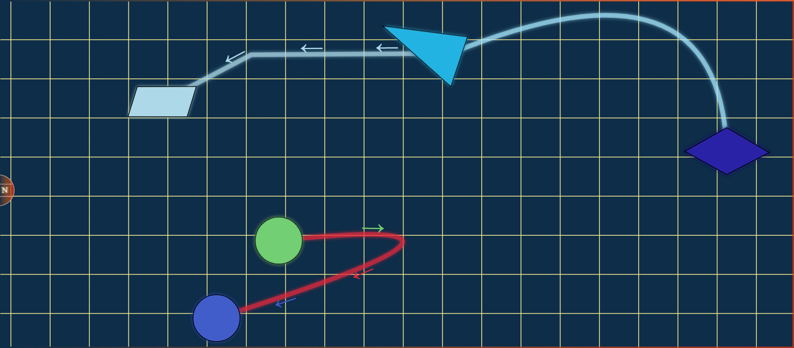

# The Diagram Builder: LampLight

When working on larger projects it is beneficial to keep track of the project's top-level design, that is why I have created a tool to help me with this task.
The Diagram Builder: LampLight is a web-based diagram builder, designed to create aesthetically pleasing, readable, and customizable diagrams.

Diagram builder relies on two key technologies: D3.js, and SVG.
 * D3.js is essential for data binding, element manipulation and lifecycle management, as well as the simulation of Force behavior.
 * SVG, along with CSS, handles most of the graphics, including key elements such as the board and node selection menu.

User starts building diagram from the node selection menu. 
Here user can select the initial node type and drop them on the desired location on the board.
The board is where most of diagram building takes place and provides space where users can move, connect and customize nodes.
The process of building a diagram involves several key features of the LampLight that we will discuss below.

Current snapshot of the Diagram Builder: LampLight includes three key elements that users can use to build diagrams, they are Nodes, Links, and Text.
It does not sound as much but each element is highly customizable, which provides enough functionality to create highly readable diagrams.
Let's take Nodes as an example: Users can change node's shape, size, rotation, and colour, which can significantly alter node's appearance and make them visually distinct. 

Link is the second major element on the board. It has the lowest rendering priority, so it is always displayed below nodes and text. Users can connect two (or more!) nodes by first selecting them with a left mouse click and then connecting them through the context menu.

Just like nodes, links can be customized to stand out among other elements. 
Users can add and reverse directional arrows, and the shape and color of the link can also be altered. 
Additionally, the type of link can be changed, affecting how the link behaves when a user interacts with it. 
Currently, there are two different types of links: curve and line.

Users can use text nodes to add context to the diagram. 
Text nodes are treated similarly to any other nodes, except they have a higher render priority, so that text could be always displayed on top of any other node. 
Similar to the other elements, Text appearance can be customized. Users can change text size, colour, and font.